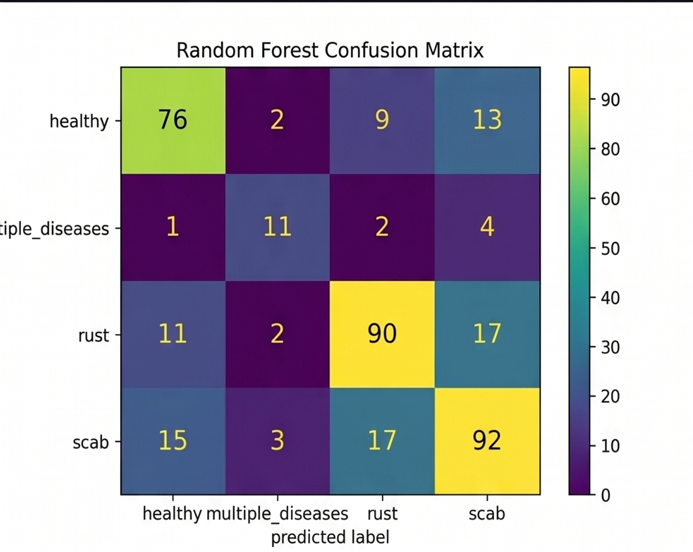
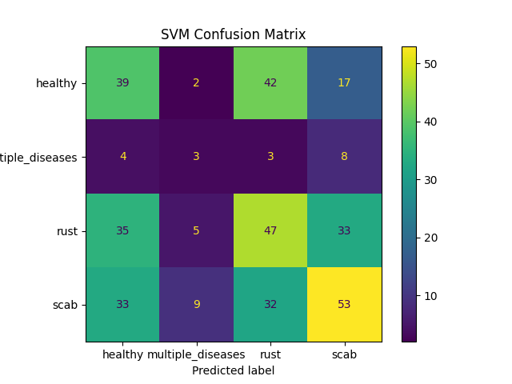
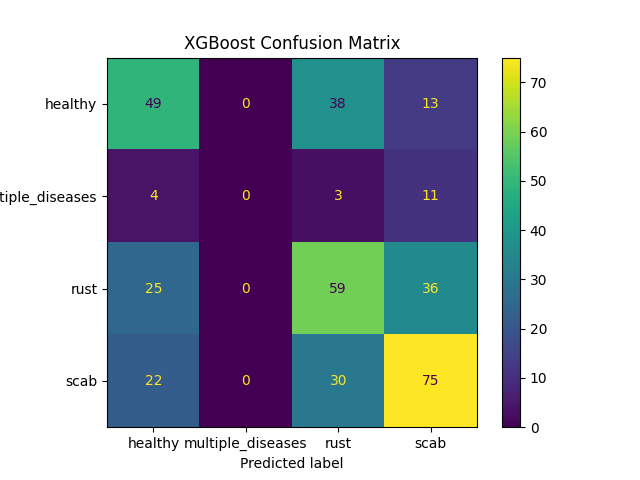

# Plant Pathology Classification using Traditional Machine Learning

This project classifies plant leaf images into four categories:
- Healthy
- Multiple Diseases
- Rust
- Scab

Unlike deep learning approaches, this project uses **handcrafted features** and **traditional machine learning algorithms**.

---

## Objective
Classify plant leaf images into multiple categories using:
- Histogram of Oriented Gradients (HOG)
- Traditional ML models:
  - Support Vector Machines (SVM)
  - Random Forest
  - XGBoost

---

## Project Structure
PlantPathology/
<pre> project-root/
├── plantpathology.py  Python script to train and evaluate models
├── plant_disease_model.pkl  Saved Random Forest model
├── results/
│   ├── random_forest_cm.png  Random Forest confusion matrix
│   ├── svm_cm.png SVM confusion matrix
│   ├── xgboost_cm.png  XGBoost confusion matrix
│   ├── random_forest_report.txt  Classification report
│   ├── svm_report.txt
│   ├── xgboost_report.txt
</pre>


---

## Results Summary

| Model         | Accuracy | Precision | F1-Score |
|---------------|----------|-----------|----------|
| Random Forest | 73.68%   | 91.24%    | 93.72%   |
| SVM (Linear)  | 38.90%   | 34.14%    | 34.06%   |
| XGBoost       | 50.14%   | 37.49%    | 38.36%   |

## Confusion Matrices

### Random Forest


### SVM


### XGBoost


---

## Outputs
- [Random Forest Report](results/random_forest_report.txt)
- [SVM Report](results/svm_report.txt)
- [XGBoost Report](results/xgboost_report.txt)
- [Saved Model](plant_disease_model.pkl)

---

## How to Run
1. Clone this repository:
   ```bash
   git clone https://github.com/<your-username>/PlantPathology.git
   cd PlantPathology
   pip install -r requirements.txt
   python plantpathology.py
## Dataset
This project uses the [Plant Pathology 2020 dataset](https://www.kaggle.com/c/plant-pathology-2020-fgvc7/data) from Kaggle.  
## Tech Stack
Python

OpenCV

Scikit-image

Scikit-learn

XGBoost

Matplotlib


